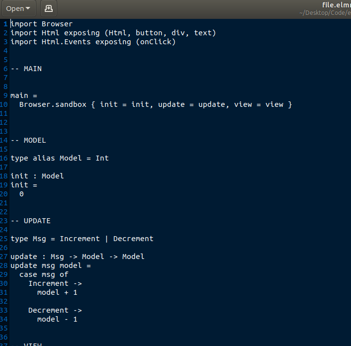
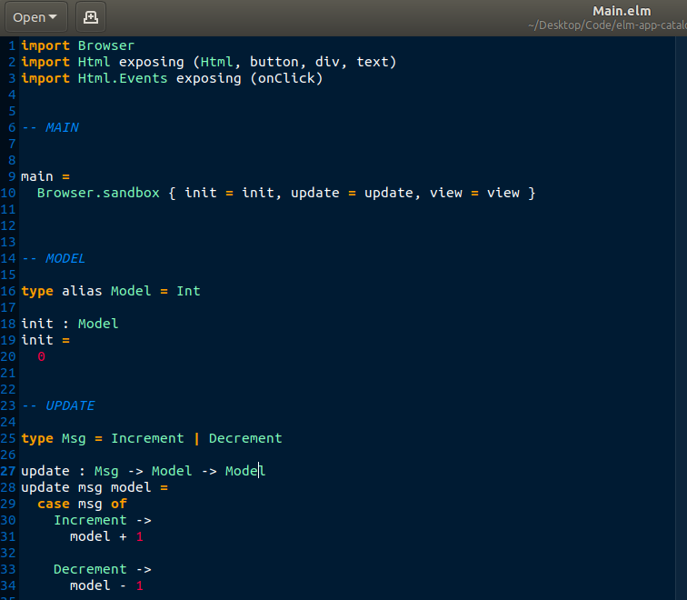

# Gedit Syntax Highlighting

[gedit](https://help.ubuntu.com/community/gedit) is a text editor that comes
default on Ubuntu distributions, and a good choice for editing your Elm files.

The `.lang` extension file is an xml specification that tells gedit how to
highlight code syntax. This repository provides a simple [elm.lang](elm.lang)
that you can copy into your editor folder to see a beautifully rendered syntax!

**Before Install**



**After Install**



So beautiful! It actually is just a tweak of haskell.lang, a suggestion made
by brian [on a community post](https://discourse.elm-lang.org/t/syntax-highlighting-for-gedit/5538/2).

## Install
Installation means simply copying the file into the language-specs folder
that your gedit installation uses. For example:

**1. Clone the Repository**

```bash
git clone https://www.github.com/vsoch/elm-editors
cd elm-editors
```

**2. Inspect your Installed Syntax Highlighters**
We will be installing to `/usr/share/gtksourceview-3.0/language-specs/`. Let's
peek into this location to see how many languages you have off the bat!

```bash
ls /usr/share/gtksourceview-3.0/language-specs/
actionscript.lang  cmake.lang     dot.lang      gtk-doc.lang           json.lang      matlab.lang     opal.lang       rpmspec.lang        tcl.lang
ada.lang           cobol.lang     dpatch.lang   gtkrc.lang             julia.lang     mediawiki.lang  opencl.lang     rst.lang            texinfo.lang
ansforth94.lang    cpphdr.lang    dtd.lang      haddock.lang           language2.rng  meson.lang      pascal.lang     ruby.lang           thrift.lang
asp.lang           cpp.lang       eiffel.lang   haskell.lang           language.dtd   modelica.lang   perl.lang       rust.lang           vala.lang
automake.lang      csharp.lang    erlang.lang   haskell-literate.lang  language.rng   mxml.lang       php.lang        scala.lang          vbnet.lang
awk.lang           css.lang       fcl.lang      html.lang              latex.lang     nemerle.lang    pig.lang        scheme.lang         verilog.lang
bennugd.lang       csv.lang       forth.lang    idl-exelis.lang        lex.lang       netrexx.lang    pkgconfig.lang  scilab.lang         vhdl.lang
bibtex.lang        cuda.lang      fortran.lang  idl.lang               libtool.lang   nsis.lang       po.lang         sh.lang             xml.lang
bluespec.lang      def.lang       fsharp.lang   imagej.lang            llvm.lang      objc.lang       prolog.lang     sml.lang            xslt.lang
boo.lang           desktop.lang   gap.lang      ini.lang               lua.lang       objj.lang       protobuf.lang   sparql.lang         yacc.lang
cg.lang            diff.lang      gdb-log.lang  jade.lang              m4.lang        ocaml.lang      puppet.lang     sql.lang            yaml.lang
changelog.lang     d.lang         genie.lang    java.lang              makefile.lang  ocl.lang        python3.lang    sweave.lang
chdr.lang          docbook.lang   glsl.lang     javascript.lang        mallard.lang   octave.lang     python.lang     systemverilog.lang
c.lang             dosbatch.lang  go.lang       j.lang                 markdown.lang  ooc.lang        R.lang          t2t.lang
```

This is pretty cool, because it means if you ever want to write your own custom syntax
highlighter, you have many examples to go from.

**3. Copy the file**

```bash
sudo cp elm.lang /usr/share/gtksourceview-3.0/language-specs/
```

That's it! You will likely need to close ALL gedit sessions and open a new one to see the change.
